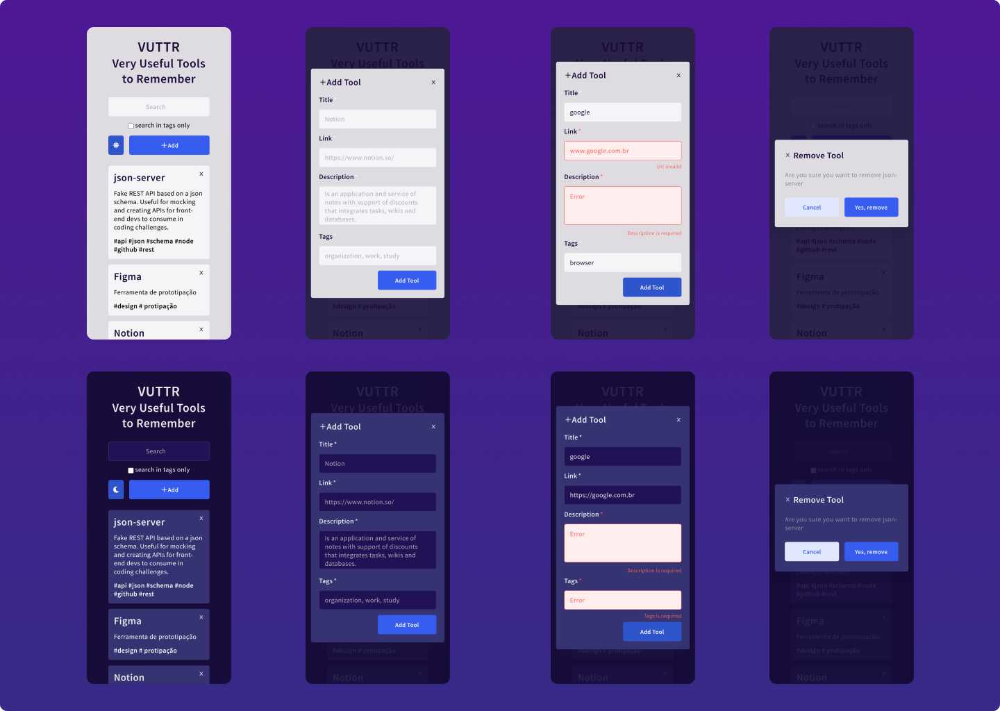
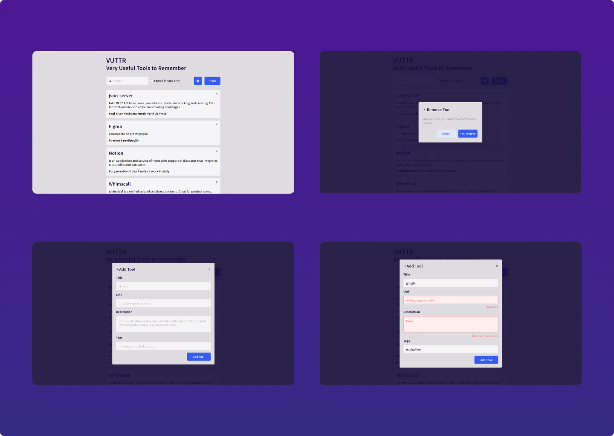
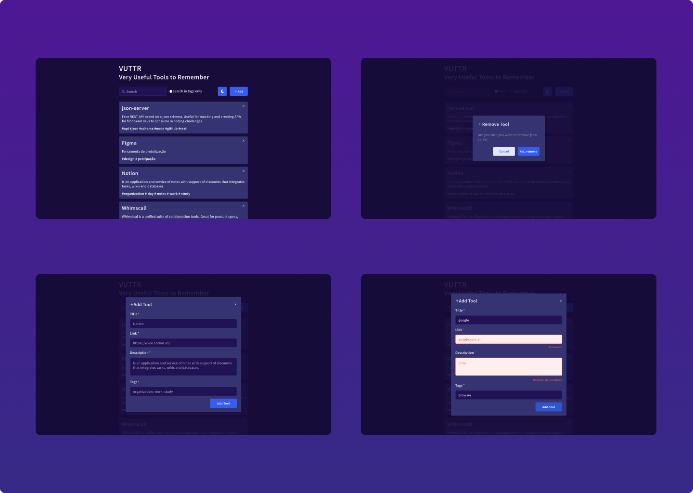

<p align="center">
  

  
  
  <a href="https://github.com/IgorTargino/podcastr/commits/master">
    
  </a>
    
   
  
</p>

## 🧐 Sobre o projeto

Uma aplicação para gerenciar ferramentas com seus respectivos nomes, links, descrições e tags.<br>
<a align="center" target="blank" href="https://podcastr-sage.vercel.app/">
    
</a>

## 🎨 Layout

### Telas Mobile

<div align="center">
  
</div>

### Telas Desktop-light

<div align="center">
  
</div>

### Telas Desktop-dark

<div align="center">
  
</div>

## ⚙️ Funcionalidades

- [x] Lista das ferramentas cadastradas;
- [x] Botão add - abre modal para inserção de novas ferramentas;
  - [x] Formulário para inserção novas ferramentas;
  - [x] Validação dos dados;
- [x] Botão x(remove) - abre modal de remoção de ferramentas;
- [x] Busca por ferramentas dinamicamente (global ou utilizando apenas tags);
---
## Como executar o projeto
### Pré-requisitos
- git 
- Node.js
- NPM ou Yarn
### Variáveis de Ambiente
Além das ferramentas anteriores é necessária criar uma váriavel de ambiente .env.local na raiz do projeto e adicionar as seguintes variáveis

 API_URL=https://my-json-server.typicode.com/IgorTargino/podcastr
### Instalação
```
# Abra o terminal e copie este repositório com o comando
$ git clone https://github.com/IgorTargino/vuttr.git

# Acesse a pasta do projeto no prompt de comando 
$ cd vuttr

# Instale as dependências
yarn install
ou
$ npm install

# Execute o servidor
$ yarn server
ou
$ npm run server

# Execute a aplicação
$ yarn start
ou
$ npm run start

# Acesse http://localhost:3000 no seu navagador.

```
## 🚀 Tecnologias 
Tecnologias utilizadas para desenvolver o projeto:
- react.js
- typescript
- react-hook-form
- context
- axios
- sass
- prettier
- eslint


## 🦸‍♂️ **Autor**

<p>
 <sub><strong>🌟 Igor Targino Marinho🌟</strong></sub>
</p>

[](https://www.linkedin.com/in/igor-targino/)
[](mailto:igortargino01@gmail.com)

>Este projeto foi desenvolvido por **[Igor Targino](https://github.com/IgorTargino)**
Se gostou, dá ⭐, vai me ajudar 😉
